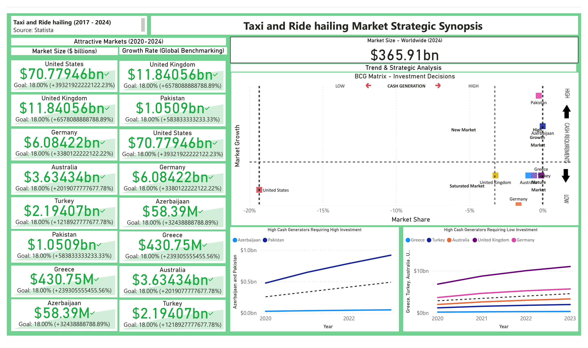

# Taxi & Ride-hailing Market
Services that use smartphone to connect community drivers with passengers are variously referred to as transport network companies (TNCs) or ride-hailing services. Ride-hailing services provide convenient door-to-door (A to B) transport by connecting passengers with regular drivers driving their personal vehicle / taxi drivers driving a licensed taxi registered with a particular ride-hailing mobile app provider.
## Indsutry Insights - 8 metropolises in action
The global ride-hailing market is expected to reach at a valuation of US$ 365.9 billion through a compound annual growth rate (CAGR) of 17.5% by 2024 and hence is an interesting and promising market to look into.
- United States, United Kingdom, and Germany are expected to be the three biggest markets by 2024.
- Australia and Turkey are expected to be big markets, with Pakistan expected to reach a market size of above $1 billion by 2024.
- Greece and Azerbaijan would value at 430.75 million and 58.39 million respectively by 2024.
### Growth Trend
- United Kingdom and Pakistan are the highest growth markets with an expected to grow by more than 550% by 2024.
- United States, Germany, and Azerbaijan are expected to grow by more than 300% by 2024.
- Greece, Australia, and Turkey are expected to grow by more than 100% by 2024.
### Emerging Markets That Show Potential
BCG matrix was used to back recommendations with data. According to the insights of the matrix plots;
- Pakistan and Azerbaijan are expected to be High Growth Markets with an exponential growth trend.
- The USA is  expected to become a Saturated Market
- Australia, Germany, Greece, and the United Kingdom are expected to become Mature Markets with a steady growth trend

## Demographical insights which need attention
- Australia, the USA, Germany, Turkey are expected to have the highest growing online sales in the market
- Germany, Australia, the USA, and Turkey are expected to have the highest decline rate in offline sales in the market
- Greece, Azerbaijan, and Pakistani online users are expected to pose growth opportunities in the region. Nations with a growing user rate show a higher potential of grabbing customer attention as new people are encouraged to interact with firms in the digital space
- Steady user penetration rate in the USA, Germany, and the UK could be an indicator of a saturated consumer base.
- Pakistan has the highest user concentration in the 18-24 and 25-34 age brackets and the lowest population concentration in the 35-44 age bracket. Similarly, female users account for 36% of the users and male users account for 64% of the users. Both these areas could be used as a focal point to explore for untapped opportunities.

## Looking Forward
With the rapid growth of ridesharing and carsharing; the way people travel from point A to B is becoming increasingly personalized. However, as uncertainty abounds the speed of transition has seen a shift. The share of people wanting to buy personally owned, driver driven vehicles is on a decline. The future is now looking ahead to multimodal travel, driverless vehicles and shared mobility models. As need for personalization increases, companies in the industries ranging from insurance and media, to healthcare and energy are looking towards ways of creating value in this emerging environment. There are four elements which need to be focused on. These elements describe the choices and trade-offs with which players in the market look to capture value in.

